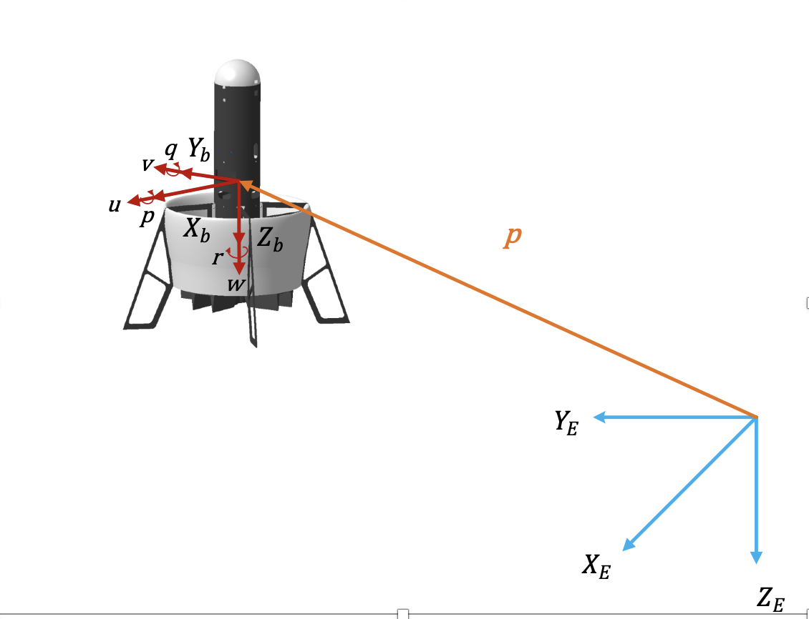
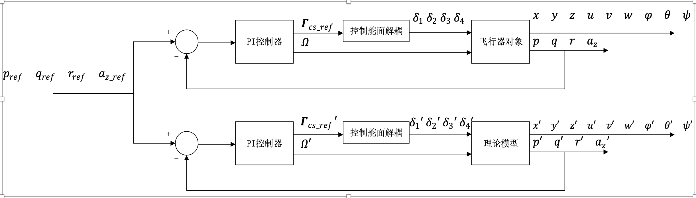
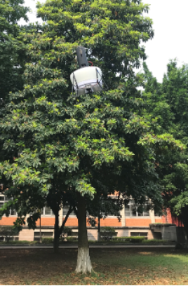
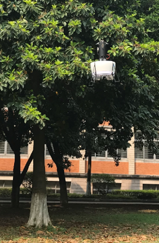
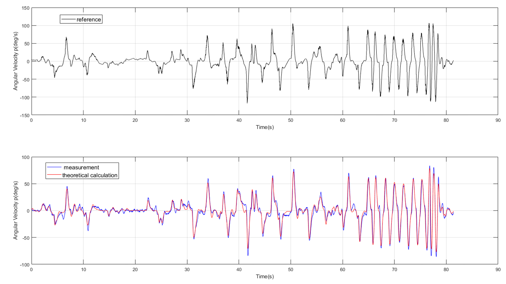
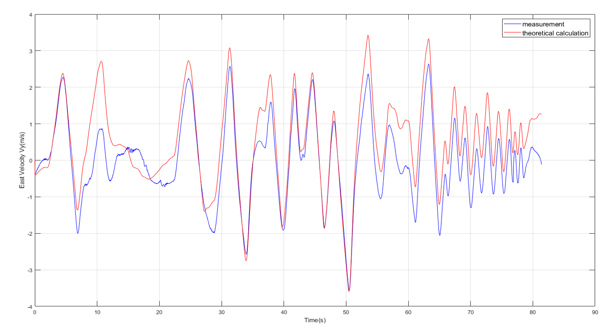
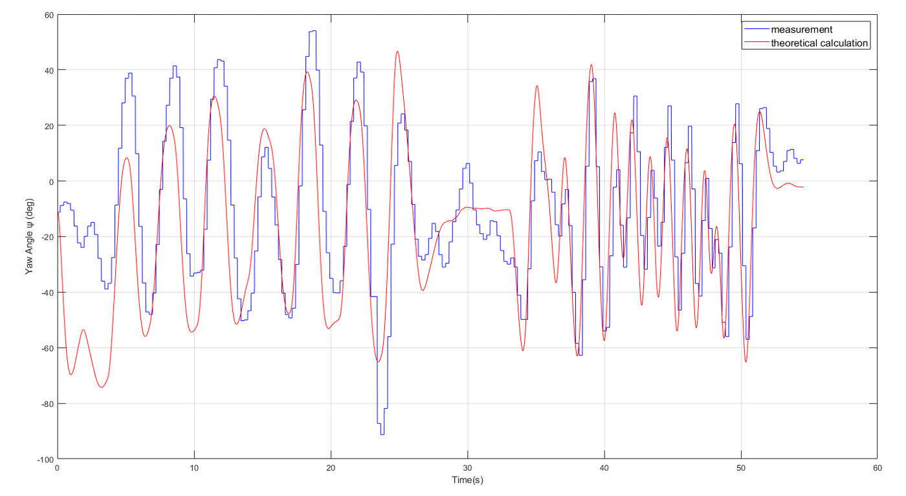
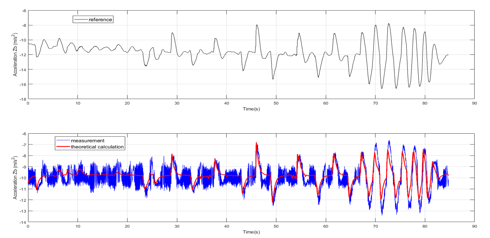
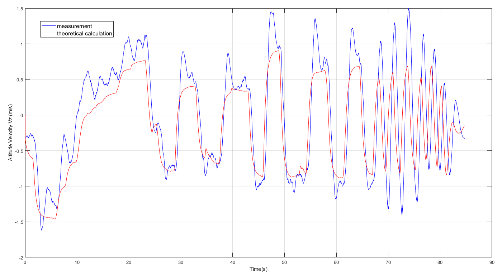

# Ducted-Fan-UAV-Simulation

<div id="sidebar"><a href="./README.md" target="_blank"><font color=#0000FF size=5px >[ENGLISH]<font></center><a></div>


This is a MATLAB & Simulink simulation about the Ducted Fan UAV, which started on 2019-4-21.

The characteristic of this simulation is to provide a control system framework for UAVs with redundant configuration control surfaces (such as Ducted Fan UAV), which includes the control allocator(including most of the mainstream control allocation algorithms for use), an ADRC controller, and a state estimator (not perfect).

With the help of Simulink Coder, the algorithm of this simulation has been run on the actual aircraft and achieved the desired effect.

## model validation



In order to examine the accuracy of the model, the method of comparing the actual flight test with the theoretical model is used to verify. Specifically, in the actual flight test, by inputting signals to the system, the state response of the actual detection is compared with the state response of the theoretical calculation.

In actual flight operations, it is very difficult to control the flight directly by controlling the deflection angle of the rudder surface. Considering flight safety, a PI controller is connected in series with each of the four channels of the aircraft p, q, r, a_z to verify the closed-loop system. At this time, the system input becomes the reference input of p, q, r, a_z.

In the verification comparison diagram below, the black curve represents the reference input, the blue curve represents the actual measurement of the state, and the red curve represents the theoretical estimation of the state.





The measurement and theoretical calculation results of the roll angular velocity p are shown in the figure below.



The measurement and theoretical calculation results of the roll angle \varphi are shown in the figure below.


The measurement and theoretical calculation results of the velocity V_y in the ground coordinate system are shown in the figure below.



The measurement and theoretical calculation results of the yaw angular velocity r are shown in the figure below.


The measurement and theoretical calculation results of the yaw angle \psi are shown in the figure below.



The measurement and theoretical calculation results of the Z_b-axis acceleration dot{\omega} are shown in the figure below.



The measurement and theoretical calculation results of the altitude velocity V_z in the ground coordinate system are shown in the figure below.




## Getting Started

This project is developed under Windows with the help of MATLAB. To run this project, only simple operations are required. The uav routine that comes with Matlab is also organized in a similar way. Through this project, you can understand MATLAB's Simulink Aerospace blockset, matlab Project Management
and source code management in git and Simulink projects.

### Prerequisites

Required software:

1.MATLAB2018 or later。

2.flightgear(optional)。

3.git(optional)。

### Installing

Use git to clone this project to the local:

```
git clone https://github.com/mengchaoheng/Plan-D.git
```

### Running the tests

1. Open MATLAB, and change the matlab folder to the directory where the project is.

2. Double-click the PRJ file `PlanD.prj` in the project root directory to start the simulation program.

3. Click Run in the simulink module named `flightSimulation.slx` to run.

You can set startup items in the `startVars.m` file of `\plan-D\utilities` (after setting, run `startVars.m` and then run `flightSimulation.slx`), select different input signals, controllers , Control allocation algorithms and so on. For example, to use the input of a certain flight as the reference input of the simulation, you can set the `VSS_COMMAND` of the `startVars.m` file to `2`, and run `startVars.m`. Then run `flightSimulation.slx` again (pay attention to setting the simulation time, which is about 53s).

## Contributing

* **Meng Chao Heng** - *Initial work* - https://github.com/mengchaoheng

## Versioning

V7

## Authors

* **Meng Chao Heng** - *Initial work* - https://github.com/mengchaoheng

## License

This project is licensed under the MIT License - see the [LICENSE.md](LICENSE.md) file for details

## Acknowledgments


* Prof.Peter

	*Provide financial support for this project.

* Dr.CZH

	*Provide all experimental data for this project! Especially the mathematical model parameters and aerodynamic characteristic data of Ducted Fan.


